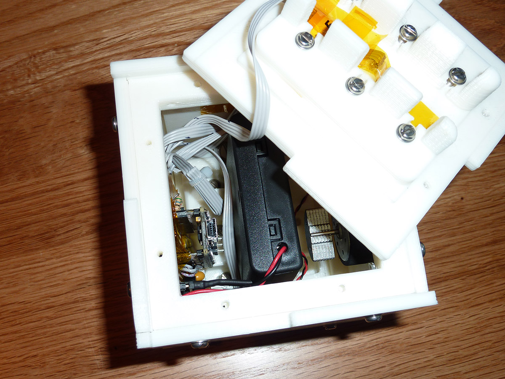

# Introduction

This project was constructed for a leaving gift for [a colleague of ours](http://www.jwhitham.org/) when he left the University to go to industry. To remind him of his time here we built a cube which liked to always be pointing towards the University. When its front face was correctly oriented the cube would be largely silent, but if incorrectly oriented it would become angry and start bleeping and vibrating until it was reoriented. The colleague was called Jack, so we called it the JaCube because we are nothing if not lacking in imagination.

### Video

Here is an edited video of the cube in action. In the first part of the video the cube is 'happy' so it plays various animations and light patterns. Note that the cube was in a demonstration mode for the shooting of this video. Under normal use it only does anything every few hours. At the end I rotate the cube away from its preferred orientation and it gets upset.

### Images

This shows how the cube is opened. The top face unscrews revealing a battery brace which holds a battery pack of 4 AA batteries in place.

With the battery pack removed, almost all the internals are visible in this picture. The offset motor (for vibration) is glued to the top face, the circuit board to the bottom, and the piezo buzzer for sound output can be seen to the right. Sensing is provided by a 10 degrees of freedom (compass, barometer, and accelerometer) daughter board which is behind the Arduino.

The speaker is superglued to the case for resonance, and the centre of each face contains an RGB LED.

# Construction

We designed the cube to be 3D printed in PLA plastic. The cube is composed of six faces screwed around a brace and battery holder. You can see the cube as it appears in [OpenSCAD](http://www.openscad.org/) below, and a version without one of its faces to expose the interior detail.

The SCAD code can be found in the repository under `/scad/`. The STL and gcode files are also available.

# Software

The software runs on an [Arduino Nano](https://www.arduino.cc/en/Main/ArduinoBoardNano). There are a number of interesting features of the software to highlight.

## LEDs
This project was built before smart LED strips (such as the [Neopixel](https://www.adafruit.com/category/168) or other [WS2811](https://www.adafruit.com/datasheets/WS2811.pdf)-powered devices) were available. The LEDs used in this project were [common anode RGB LEDs](https://www.sparkfun.com/products/10820). These LEDs are actually 3 LEDs (one red, one green, and one blue) in the same package, with their anodes tied together. To produce a full range of colours it is necessary to [PWM](https://www.arduino.cc/en/Tutorial/PWM) the three cathodes. We used 6 of these multicoloured LEDs, one in the centre of each cube face. If we simply connected the anodes to 5 volts and the cathodes to the Arduino, this would require 18 PWM pins which is far more than available on our development board. 

To solve this problem we use a technique called LED scanning. In this approach we connect the 6 anodes to 6 IO pins of the Arduino, tie all cathodes together and connect them to three more IO pins. To assert an LED we set its corresponding anode to 1, and set the desired colour on the three cathodes by setting red, green, or blue to 0. This is shown on the diagram below, which for brevity only shows 3 LEDs.

When combined with software PWM for the three cathodes this approach allows the six RGB LEDs to be PWMed using only 9 pins. Because only one LED is on at any one time the maximum effective brightness of the LEDs is reduced. We compensate for this by overvolting the LEDs. LED datasheets will usually differentiate between peak sustained voltage and peak instantaneous voltage. If the scanning interval is kept fast enough then the LEDs can be safely driven above their normal usage conditions. Be careful when doing this, be be sure to study the datasheets of the devices you are using.

## Sensing
The cube uses a [10 degrees of freedom](http://playground.arduino.cc/Main/WhatIsDegreesOfFreedom6DOF9DOF10DOF11DOF) board for its sensing. This is a board with a ADXL345 3-axis accelerometer, and a HMC5883L 3-Axis Digital Compass. (The board also contains a barometer which we did not use.) The accelerometer is used so that the cube can determine which way is "up" by looking for a downwards pull of 1G (one 'Earth's Gravity'). This is used to orient the cube's frame of reference so that the output from the 3D digital compass can be interpreted correctly into a bearing from North. We considered using GPS, but as the power draw of GPS is high and the project is designed to be battery-powered we instead simply determined the rough compass direction that the cube wants to be pointed in and wrote that into the EEPROM of the Arduino. We also provided a simple interface to update the compass bearing should the recipient ever move house! Were we to redo this project, [cheap wifi chips](https://github.com/iangray001/esp8266) now exist which could be used to power up once on start up, determine the cube's location and bearing, and then power down again.

## Power use
As this project is battery-powered we had to be very careful about minimising power use wherever possible. The 10 DoF sensor board consumes quite a lot of power, so the Arduino can enable and disable its power by toggling the gate of a transistor. The board is only activated infrequently to check the cube's orientation. This means that the cube will take a few seconds to notice if it is pointing the wrong way, but it achieves much longer battery life as a result.

We also use the [Narcoleptic library](https://code.google.com/p/narcoleptic/source/browse/) to put the Arduino into low-power mode when it is sleeping. As the cube spends hours at a time doing nothing, it is best to make sure that the Arduino does nothing as efficiently as possible. By putting the processor into a lower-power sleep than the normal Arduino libraries we vastly increased its battery life.

You might have noticed from the photos above that the 'Arduino' we are using is actually a 'Funduino'. This is a cheap Arduino clone that you will commonly receive if you try to buy an Arduino from certain low-cost online retailers. Often this is fine, but when measuring power use with an ammeter we were seeing far higher values than expected. We traced this to the voltage regulator used on the Funduino. For whatever reason this component was correctly regulating but wasting a lot of power to do so. We replaced it with a better regulator from a more reliable manufacturer.

## Sounds
Do you remember [RTTTL](https://en.wikipedia.org/wiki/Ring_Tone_Transfer_Language)? It was a text-based language for typing monophonic ringtones into Nokia mobile phones. For some reason we decided to use RTTTL to describe the tones played by the cube during its animations. This was not a 'sensible' decision by most metrics as RTTTL is very space-inefficient and requires parsing. We did it because the Nano has plenty of space so we were not constrained by that, and there are millions of pre-made tunes on the internet for us to just download and use meaning that we could get the project working before our deadline. 

Notes are played from a simple RTTTL parser using the [Tone](https://www.arduino.cc/en/Reference/Tone) library. The audio output device is a small piezo element [such as this one](https://www.sparkfun.com/products/10293). It is very quiet when held in the hand, but supergluing it to the printed plastic frame provides a nice loud resonance.

